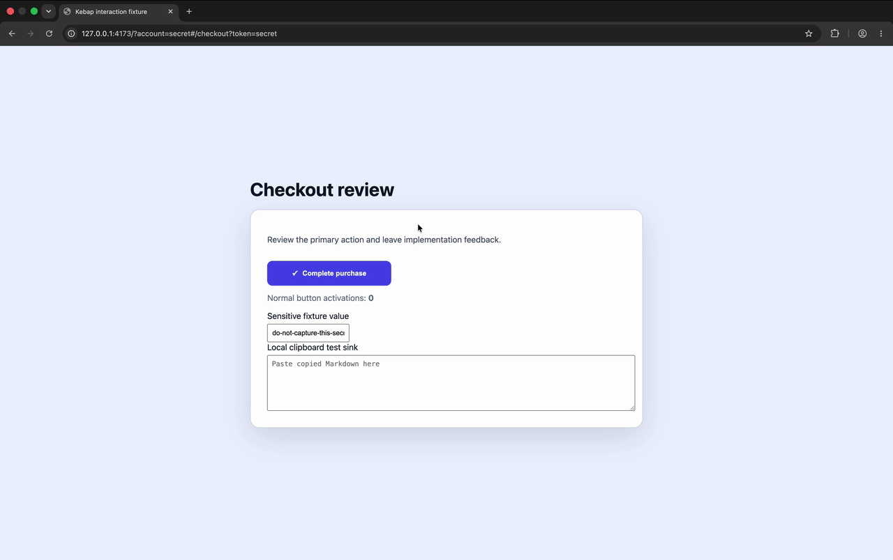

<h1> Kebap</h1>

Kebap is a local-only Chrome extension for capturing element-specific UI feedback and handing it to a coding agent as Markdown.

## Turn visual feedback into actionable code changes

Point at a UI problem, describe the fix, and let Kebap package the context a coding agent needs to find the right code. No DevTools spelunking, fragile screenshots, or long explanations about which button you meant.

- **Target precisely.** Hold a modifier, hover any element, and move through its ancestor chain before selecting it.
- **Capture useful evidence.** Kebap records sanitized HTML, selectors, visible text, dimensions, key styles, and page context automatically.
- **Enrich React apps.** When available, zero-config React support adds component names and source hints without sacrificing generic HTML support.
- **Build a focused queue.** Collect, review, and edit feedback for one browser tab without changing the site's viewport.
- **Hand off cleanly.** Copy—or Cut with Undo—a chronological, coding-agent-ready Markdown fix list.
- **Keep it private.** Everything stays local to the browser session. Kebap makes no network requests.

## Demo



## Load the extension

1. Open `chrome://extensions`.
2. Enable **Developer mode**.
3. Choose **Load unpacked** and select this directory.

Kebap does not request access to every site. Clicking its toolbar icon or invoking its keyboard shortcut grants temporary access to the current tab so it can inspect the page. It does not make network requests or send captured data anywhere.

## Use it

1. Click the extension icon or press `Control+K` on macOS (`Ctrl+Shift+K` elsewhere) to activate Kebap for the current tab.
2. Hold `Alt`/`Option` and hover an element.
3. Use Up/Down while holding the modifier to navigate its ancestors.
4. Click to select without activating the page element.
5. Type a comment and press Enter. Use Shift+Enter for a newline.
6. Use the icon or shortcut again to reopen the queue.
7. Copy with `Option+Shift+C` and Cut with `Option+Shift+X` (`Alt` instead of `Option` outside macOS), or use the panel buttons.

The panel's **Pick** button provides a one-shot selection mode when holding a modifier is inconvenient or unavailable.

Each tab has its own queue. It survives reloads and navigation in that tab, and is deleted when the tab closes.

## Development

```sh
npm test
npm run check
npm run serve:fixture
npm run package:webstore
```
